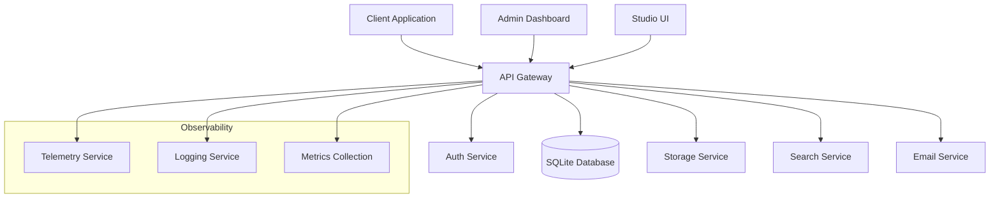

# KoyaLite

KoyaLite is a lightweight, self-hostable backend platform that empowers solo developers, small teams, and startups to launch full-stack applications quickly without managing complex infrastructure.

## Features

- 🗄️ **SQLite-Based**: Built on SQLite for simplicity and reliability
- 🔒 **Row-Level Security**: Fine-grained access control with policy evaluation
- 🔑 **Built-in Auth**: User management with RBAC using Lucia and Arctic
- 📡 **Auto-Generated APIs**: REST and GraphQL APIs from your schema
- 📂 **File Storage**: S3-compatible storage via SeaweedFS
- 🔍 **Vector Search**: Semantic search powered by Weaviate
- ⚡ **Edge Functions**: Serverless functions using Deno runtime
- 📧 **Email Integration**: Beautiful emails with React.email and Resend
- 📊 **Admin Dashboard**: Powerful control over your backend
- 🎨 **Studio UI**: Visual database and schema management

## Project Structure

```
koyalite/
├── apps/                      # Applications
│   ├── admin/                # Admin Dashboard
│   ├── studio/              # Database Studio UI
│   ├── docs/                # Documentation Site
│   └── api/                 # Main API Service
├── packages/                 # Shared Packages
│   ├── core-types/          # Shared TypeScript Types
│   ├── sdk/                 # TypeScript Client SDK
│   ├── rls/                 # Row Level Security Engine
│   ├── logger/              # Structured Logging
│   ├── storage-client/      # SeaweedFS Client
│   ├── search-client/       # Weaviate Client
│   ├── email-templates/     # React Email Templates
│   ├── ui-components/       # Shared UI Components
│   └── telemetry/          # Observability Tools
└── infrastructure/          # Deployment & Config
```

## Tech Stack

### Backend

- **Runtime**: Node.js 18+
- **API Layer**: Express.js + GraphQL Yoga
- **Database**: SQLite + Drizzle ORM
- **Auth**: Lucia + Arctic
- **Storage**: SeaweedFS
- **Search**: Weaviate
- **Functions**: Deno Runtime

### Frontend

- **Framework**: Next.js 14
- **UI Components**: Radix UI
- **Styling**: Tailwind CSS
- **Data Viz**: Tremor
- **Forms**: React Hook Form + Zod

### Developer Experience

- **Language**: TypeScript
- **Package Manager**: pnpm
- **Monorepo**: Turborepo
- **Testing**: Vitest
- **Linting**: ESLint + Prettier
- **Documentation**: Docusaurus

### Infrastructure

- **Gateway**: NGINX
- **Observability**:
    - Logging: Pino + Loki
    - Metrics: Grafana
    - Tracing: OpenTelemetry
    - Analytics: PostHog

## Getting Started

1. **Prerequisites**

    ```bash
    # Install pnpm if not already installed
    npm install -g pnpm

    # Install dependencies
    pnpm install
    ```

2. **Development Setup**

    ```bash
    # Start all services in development mode
    pnpm dev

    # Or start specific apps/services
    pnpm dev --filter=admin
    pnpm dev --filter=studio
    pnpm dev --filter=api
    ```

3. **Build**

    ```bash
    # Build all packages and apps
    pnpm build

    # Build specific package/app
    pnpm build --filter=@koyalite/sdk
    ```

4. **Testing**

    ```bash
    # Run all tests
    pnpm test

    # Run tests with coverage
    pnpm test:coverage
    ```

## Documentation

- [Getting Started](./docs/getting-started.md)
- [Architecture](./docs/architecture/README.md)
- [API Reference](./docs/api/README.md)
- [SDK Guide](./docs/sdk/README.md)
- [Deployment](./docs/deployment/README.md)
- [Contributing](./CONTRIBUTING.md)

## Packages

### @koyalite/sdk

TypeScript SDK for interacting with KoyaLite APIs. Includes:

- HTTP client with retry logic
- WebSocket support
- Server-Sent Events
- Type-safe API methods

### @koyalite/rls

Row Level Security engine for policy evaluation:

- SQL-like policy syntax
- Context-aware evaluation
- Variable substitution
- Function support

### @koyalite/ui-components

Shared UI components built with Radix UI:

- DataTable with sorting
- Dialog/Modal system
- Form components
- Buttons and inputs

### @koyalite/email-templates

React-based email templates:

- Welcome emails
- Notification templates
- Password reset flows
- Responsive design

## Contributing

We welcome contributions! Please see our [Contributing Guide](./CONTRIBUTING.md) for details.

## License

MIT

## Support

- [Discord Community](https://discord.gg/koyalite)
- [GitHub Issues](https://github.com/koyalite/koyalite/issues)
- [Documentation](https://docs.koyalite.dev)

## Services

### Core Services

#### API Service (`apps/api`)

- Main REST and GraphQL API gateway
- Handles authentication and authorization
- Implements RLS policy enforcement
- Routes requests to appropriate services
- Manages database connections and transactions

#### Admin Dashboard (`apps/admin`)

- Administrative interface for system management
- User and role management
- RLS policy configuration
- System monitoring and metrics
- Audit log viewing
- Email template management

#### Studio UI (`apps/studio`)

- Visual database management interface
- Schema design and visualization
- Data browsing and editing
- Query builder and execution
- Real-time data preview

#### Documentation Site (`apps/docs`)

- Developer documentation and guides
- API reference documentation
- SDK usage examples
- Deployment guides
- Contributing guidelines

### Shared Packages

#### SDK (`packages/sdk`)

The TypeScript client SDK provides:

- Type-safe API client
- Real-time subscriptions
- File upload/download
- Authentication helpers
- Error handling

#### RLS Engine (`packages/rls`)

Row Level Security implementation with:

- Policy parsing and compilation
- Context-aware evaluation
- Variable substitution
- Function registry
- Performance optimization

#### Storage Client (`packages/storage-client`)

SeaweedFS client implementation:

- File upload/download
- Streaming support
- Metadata management
- Access control
- Chunked transfers

#### Search Client (`packages/search-client`)

Weaviate integration providing:

- Vector search capabilities
- Semantic query processing
- Batch operations
- Index management
- Query optimization

#### Logger (`packages/logger`)

Structured logging with:

- Log level management
- Context propagation
- Output formatting
- Log rotation
- Performance monitoring

#### Email Templates (`packages/email-templates`)

React-based email system:

- Responsive templates
- Dynamic content
- Localization support
- Preview capability
- Template management

#### UI Components (`packages/ui-components`)

Shared React components:

- Data tables and grids
- Forms and inputs
- Modals and dialogs
- Charts and visualizations
- Loading states

#### Telemetry (`packages/telemetry`)

Observability infrastructure:

- Distributed tracing
- Metrics collection
- Error tracking
- Performance monitoring
- Usage analytics

### Service Architecture



### Service Communication

- **API Gateway**: Routes requests and handles authentication
- **Service Discovery**: DNS-based in development, configurable for production
- **Caching**: Built-in caching layer with configurable backends
- **Error Handling**: Centralized error processing and reporting
- **Rate Limiting**: Configurable rate limits per endpoint/user
- **Load Balancing**: NGINX-based load balancing for horizontal scaling

### Security

- **Authentication**: JWT-based with session support
- **Authorization**: Role-based access control (RBAC)
- **Row-Level Security**: Fine-grained data access control
- **API Security**:
    - CORS configuration
    - Rate limiting
    - Request validation
    - Input sanitization
- **Data Security**:
    - Encryption at rest
    - Secure connections
    - Audit logging

### Deployment Options

1. **Local Development**

    ```bash
    pnpm dev
    ```

2. **Docker Compose**

    ```bash
    docker-compose up -d
    ```

3. **Kubernetes**

    - Helm charts available
    - Horizontal scaling support
    - Service mesh ready

4. **Cloud Platforms**
    - AWS ECS/EKS
    - Google Cloud Run/GKE
    - Azure Container Apps/AKS
